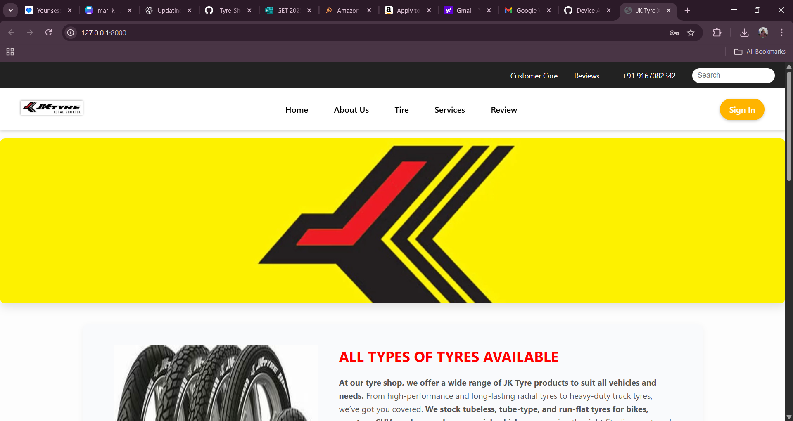
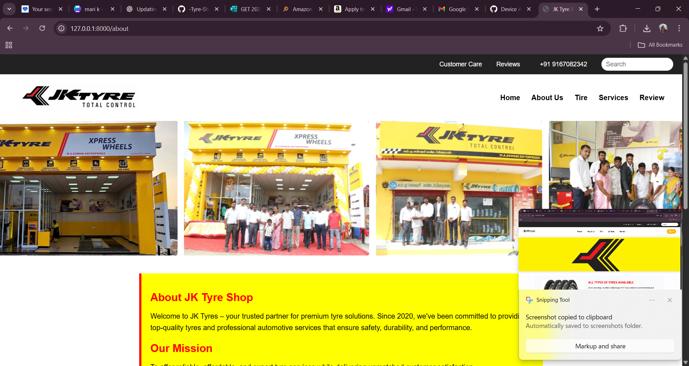

# Tyre Shop Website

A full-stack, responsive website for a tyre shop to showcase services, tyre inventory, customer reviews, and contact details. Includes an admin area to manage users and reviews.

## Features
- User registration & login
- Responsive navigation (mobile hamburger menu)
- Service & tyre listings
- Customer reviews with star rating (and image upload planned)
- Google Maps location embed
- Admin dashboard for user & review management

## Tech Stack
- **Frontend:** HTML, CSS, JavaScript
- **Backend:** Django (Python)
- **Database:** MySQL
- **Tools:** Git, VS Code, MySQL Workbench

## Screenshots

### Homepage


### About Us Page


## Getting Started (Local)

> Prereqs: Python 3.10+ and MySQL installed.

1. **Clone**
   ```bash
   git clone https://github.com/Mari-0311/-Tyre-Shop-Website.git
   cd -Tyre-Shop-Website
   ### Homepage


### About Us Page


